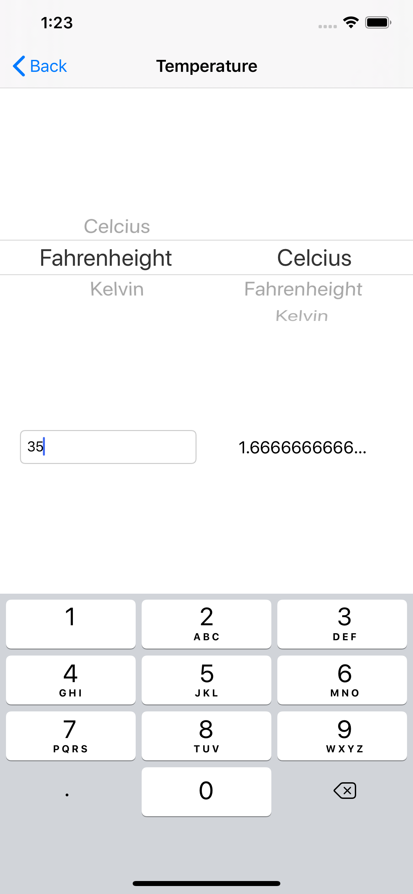

# Minimalistic-Converter-iOS

Link to App Store: https://apps.apple.com/us/app/minimalistic-unit-converter/id1500098249?ls=1

- Very simple and minimalistic design unit converter with 12 categories.

CONVERT:

* Angle
* Area
* Data Storage
* Energy
* Frequency
* Length
* Mass
* Pressure
* Speed
* Temperature
* Time
* Volume
